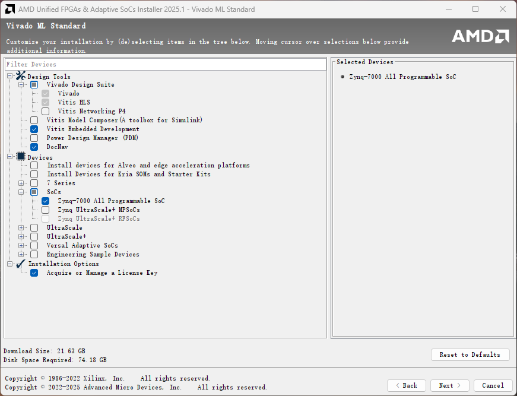
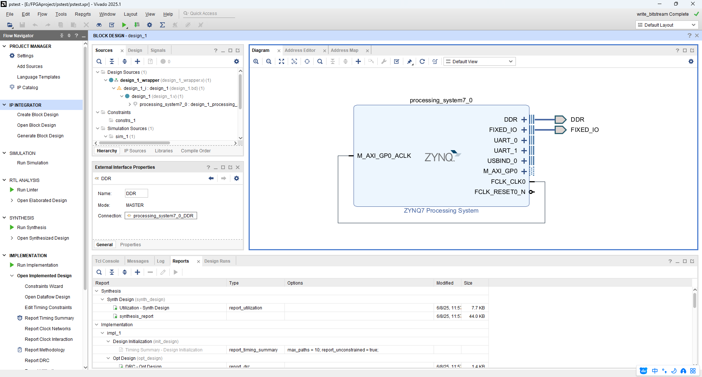
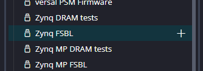
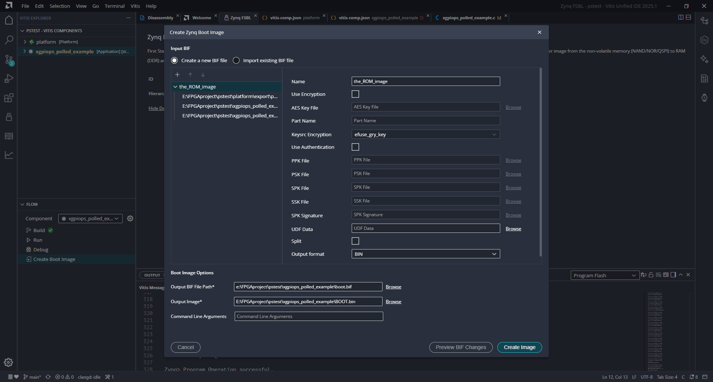
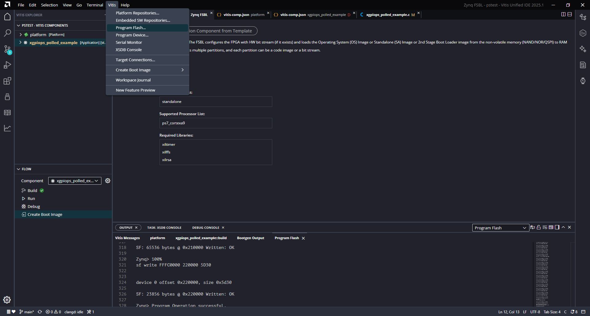

# Zynq-7000 UART1配置与GPIO LED交替闪烁示例

## 项目概述

本项目旨在演示如何在 Xilinx Zynq-7000 SoC上进行基本的嵌入式开发，主要包含以下功能：

1.  **UART1 通信**：通过 PS (Processing System) 端的 UART1 外设向串口终端发送 "Hello World" 类型的消息。
2.  **GPIO 控制**：通过 PS 端的 GPIO (General Purpose Input/Output) 控制连接到 MIO0 和 MIO13 引脚的两个 LED 灯，使它们以大约1秒的周期交替闪烁（每个状态持续约0.5秒）。

本项目基于 Xilinx Vivado（版本2025.1）进行硬件设计和配置，使用 Xilinx Vitis 进行软件开发和调试。

**开发日期:** 2025-06-08

## 硬件环境

*   **目标平台**：基于 Xilinx Zynq-7000 SoC 的开发板 (Alinx黑金7010)。
*   **LED 连接**：
    *   开发板一个 LED 连接到 PS MIO0 引脚。
    *   另一个 LED 连接到 PS MIO13 引脚。
*   **UART 连接**：开发板上的 UART1 转 USB 接口，用于连接 PC 串口终端。

## 软件环境

*   **Vivado**：用于硬件设计、Zynq PS 配置、Bitstream 生成。
*   **Vitis Unified Software Platform**：用于嵌入式软件开发、编译、调试。

## 开发步骤

安装 Xilinx Vivado 和 Vitis 软件


### 1. Vivado硬件设计与配置

1.  **创建 Vivado 工程**：选择对应的 Zynq-7000 器件型号（`xc7z010clg400-1`）。
2.  **在 Block Design 添加 ZYNQ7 Processing System IP 核**：
    *   **MIO 配置 (MIO Configuration)**：
        *   **UART1**：使能 UART1，并将其分配给合适的 MIO 引脚（例如，MIO 48 用于 TX，MIO 49 用于 RX，或根据开发板原理图选择）。
        *   **GPIO MIO**：使能 GPIO MIO。确保 MIO0 和 MIO13 未被其他外设占用，可作为 GPIO 使用。
    *   **DDR 配置 (DDR Configuration)**：选择 `MT41J128M16HA-125`。
3.  **连接端口**：
    *   运行自动配置 (Run Connection Automation)。
    *   如果使用了 Fabric Clock，将其连接到相应的时钟输入或设置为外部。
    
4.  **生成顶层 HDL Wrapper**。
5.  **运行综合 (Synthesis) 和实现 (Implementation)**。
6.  **生成 Bitstream (Generate Bitstream)**。
7.  **导出硬件 (Export Hardware)**：
    *   左上角选择 `File > Export > Export Hardware...`。
    *   勾选 "Include bitstream"。
    *   导出为 XSA (Xilinx Support Archive) 文件。

### 2. Vitis软件开发

1.  **创建 Platform Project**：
    *   启动 Vitis。
    *   在 example 中，选择 ZYNQ FSBL 模板 (重要)。
    
    *   选择 `File > New > Platform Project...`。
    *   为平台项目命名。
    *   选择 "Create from hardware specification (XSA)"，并导入之前从 Vivado 导出的 XSA 文件。
    *   选择操作系统为 `standalone`，处理器为 `ps7_cortexa9_0`。
    *   构建平台项目。这将生成 BSP (Board Support Package)，其中包含驱动程序和 `xparameters.h` 等重要文件。

2.  **创建 FSBL (First Stage Bootloader) 应用工程 (关键步骤)**：
    *   在 Vitis 中，右键点击之前创建的平台项目，选择 `Add Application Project...` 或类似选项。
    *   为 FSBL 项目命名（例如 `fsbl_app`）。
    *   选择目标处理器 `ps7_cortexa9_0`。
    *   在模板选择页面，务必选择 **"Zynq FSBL"** 模板。
    *   完成创建并构建此 FSBL 项目。这将生成 `fsbl_app.elf` (或类似名称)。

3.  **创建用户应用程序项目 (Application Project)**：
    *   再次右键点击平台项目，选择 `Add Application Project...`（也可以在driver中添加）。
    *   为应用程序项目命名（例如 `led_uart_app`）。
    *   选择目标处理器 `ps7_cortexa9_0`。
    *   选择一个合适的模板，例如 "Hello World" 作为起点，或者直接使用提供的 `xgpiops_polled_example.c` 并进行修改。

4.  **编写/修改用户应用程序代码** (`xgpiops_polled_example.c` 或类似C文件)：
    *   **包含头文件**：
        ```c
        #include "xparameters.h"  // 包含硬件参数定义
        #include "xgpiops.h"      // GPIO驱动
        #include "xuartps.h"      // UART驱动 (如果需要发送Hello World)
        #include "xstatus.h"
        #include "xplatform_info.h" // 用于示例代码中的板卡识别
        #include <xil_printf.h>    // Xilinx提供的轻量级printf
        ```
    *   **定义常量**：
        ```c
        #define GPIO_DEVICE_ID      XPAR_XGPIOPS_0_DEVICE_ID // 来自 xparameters.h
        #define UART_DEVICE_ID      XPAR_XUARTPS_1_DEVICE_ID // UART1的设备ID (确保是1)
        #define LED_MIO0_PIN        0
        #define LED_MIO13_PIN       13
        #define HALF_SECOND_DELAY_COUNT 33000000 // 软件延时计数值，需校准
        ```
    *   **初始化 UART1** (如果需要)：
        *   查找配置 (`XUartPs_LookupConfig`)。
        *   初始化配置 (`XUartPs_CfgInitialize`)。
        *   设置波特率 (`XUartPs_SetBaudRate`，例如 115200)。
        *   发送消息 (`XUartPs_Send`)。
    *   **初始化 GPIO 控制器**：
        *   查找配置 (`XGpioPs_LookupConfig`)。
        *   初始化配置 (`XGpioPs_CfgInitialize`)。
    *   **配置 GPIO 引脚**：
        *   将 `LED_MIO0_PIN` 和 `LED_MIO13_PIN` 设置为输出方向 (`XGpioPs_SetDirectionPin`)。
        *   使能这两个引脚的输出 (`XGpioPs_SetOutputEnablePin`)。
    *   **实现 LED 交替闪烁逻辑**：
        *   在一个无限循环 (`while(1)`) 中：
            *   设置 MIO0 为一个状态 (如亮)，MIO13 为相反状态 (如灭)。
            *   调用软件延时函数 (`DelayHalfSecond()`)。
            *   切换 MIO0 和 MIO13 的状态。
            *   再次调用软件延时函数。
    *   **软件延时函数 `DelayHalfSecond()`**：
        *   使用一个 `volatile` 循环变量进行空循环计数。此处的计数值 `HALF_SECOND_DELAY_COUNT` 需要根据实际的 PS 时钟频率和编译器优化情况进行仔细的实验和调整，以获得接近0.5秒的延时。

5.  **构建用户应用程序 (Build Project)**：
    *   在 Vitis 中右键点击用户应用程序项目，选择 "Build Project"。
    *   解决编译过程中可能出现的错误。

### 3. 运行与调试 (通过 JTAG)

1.  **连接硬件**：
    *   通过 JTAG 将开发板连接到 PC (用于程序下载和调试)。
    *   通过 UART-USB 将开发板的 UART1 接口连接到 PC (用于查看串口输出)。
2.  **配置串口终端**：
    *   打开 Vitis 中的串口终端（位置左上 vitis-serial monitor）或使用其他串口工具 (如 PuTTY, Tera Term)。
    *   选择正确的 COM 端口。
    *   设置波特率为 115200，数据位 8，无校验，停止位 1。
3.  **运行/调试应用程序**：
    *   在 Vitis 中，右键点击用户应用程序项目。
    *   选择 `Run As > Launch Hardware (Single Application Debug)` 或 `Debug As > Launch Hardware (Single Application Debug)`。
    *   Vitis 会自动下载 FSBL (如果已关联到系统工程) 和用户应用程序。
4.  **观察结果**：
    *   串口终端应显示来自 UART1 的 "Hello World" 消息。
    *   连接到 MIO0 和 MIO13 的 LED 应交替闪烁。

### 4. 烧录与独立启动

#### 4.1 创建启动镜像 (BOOT.BIN)

1.  在 Vitis 中，点击系统工程 (System Project) 或空白处，选择 "Create Boot Image"。
2.  **指定输出路径**：通常命名为 `BOOT.BIN`。
3.  点击 "Create Image" 生成 `BOOT.BIN` 文件。
    

#### 4.2 烧录到 QSPI Flash

1.  在 Vitis 顶部工具栏中，选择 `Vitis > Program Flash`。
    
2.  在 "Program Flash" 对话框中进行如下配置：
    *   **Image File**: 选择上一步生成的 `BOOT.BIN` 文件（可以点击search）。
    *   **Flash Type**: 根据开发板实际使用的 QSPI Flash 型号选择。对于 Alinx 黑金7010（W25Q256FVEI），通常选择 `qspi-x4-single` 或兼容型号。**选择正确的 Flash 类型对于成功识别和烧录至关重要。**
3.  点击 "Program"。Vitis 会使用 JTAG 连接将 `BOOT.BIN` 烧录到 QSPI Flash 中。（可以从输出消息中查看flash型号，容量和已用容量）
4.  **设置启动模式**：
    *   烧录完成后，断开开发板电源。
    *   **查阅你的开发板用户手册**，将启动模式引脚（通常是跳线帽或拨码开关）设置为从 QSPI Flash 启动。
    *   重新上电。

#### 4.3 通过 SD 卡启动

1.  **准备 SD 卡**：
    *   将 SD 卡格式化为 **FAT32** 文件系统。
2.  **复制文件**：
    *   将生成的 `BOOT.BIN` 文件复制到 SD 卡的**根目录**。
3.  **设置启动模式**：
    *   断开开发板电源。
    *   **查阅你的开发板用户手册**，将启动模式引脚设置为从 SD 卡启动。
    *   插入 SD 卡到开发板卡槽。
    *   重新上电。

#### 4.4 验证独立启动

*   无论是从 QSPI Flash 还是 SD 卡启动，上电后：
    *   观察串口终端是否按预期输出 "Hello World" 消息。
    *   观察 MIO0 和 MIO13 连接的 LED 是否按预期交替闪烁。
    *   这表明 FSBL 和用户应用程序已成功独立运行。

### 5. 关键代码片段

(参考 `xgpiops_polled_example.c` 的修改版本)

*   **GPIO 初始化与设置方向**
    ```c
    XGpioPs_Config *GpioConfigPtr;
    // ...
    GpioConfigPtr = XGpioPs_LookupConfig(GPIO_DEVICE_ID);
    Status = XGpioPs_CfgInitialize(&Gpio, GpioConfigPtr, GpioConfigPtr->BaseAddr);
    // ...
    XGpioPs_SetDirectionPin(&Gpio, LED_MIO0_PIN, 1); // 1 for output
    XGpioPs_SetOutputEnablePin(&Gpio, LED_MIO0_PIN, 1);
    XGpioPs_SetDirectionPin(&Gpio, LED_MIO13_PIN, 1);
    XGpioPs_SetOutputEnablePin(&Gpio, LED_MIO13_PIN, 1);
    ```
*   **GPIO 写操作**
    ```c
    XGpioPs_WritePin(&Gpio, LED_MIO0_PIN, 1); // Turn LED on
    XGpioPs_WritePin(&Gpio, LED_MIO13_PIN, 0); // Turn LED off
    ```
*   **UART 初始化与发送 (示例)**
    ```c
    XUartPs_Config *UartConfigPtr;
    XUartPs UartPs_Inst;
    // ...
    UartConfigPtr = XUartPs_LookupConfig(UART_DEVICE_ID);
    Status = XUartPs_CfgInitialize(&UartPs_Inst, UartConfigPtr, UartConfigPtr->BaseAddress);
    // ...
    XUartPs_SetBaudRate(&UartPs_Inst, 115200);
    // ...
    char HelloWorld[] = "Hello World from UART1!
";
    XUartPs_Send(&UartPs_Inst, (u8*)HelloWorld, strlen(HelloWorld));
    ```

### 6. 故障排除与注意事项

*   **FSBL 创建问题**：务必从 Vitis 提供的 "Zynq FSBL" 模板创建 FSBL 应用工程，以确保正确的硬件初始化代码（特别是 QSPI 控制器配置）能被生成，这对于后续 QSPI Flash 烧录和识别至关重要。
*   **`XPAR_..._DEVICE_ID` 未定义错误**：通常意味着 Vitis 平台未从最新的 XSA 文件正确更新，或者 Vivado 中的硬件配置未使能相应外设。解决方法是：确保 Vivado 中已配置并使能外设 -> 重新导出 XSA -> 在 Vitis 中更新平台硬件规范 -> 清理并重新构建平台和应用程序。
*   **LED 不闪烁或状态不正确**：
    *   检查 MIO 引脚号是否正确。
    *   确认 LED 硬件连接无误，以及是高电平点亮还是低电平点亮（代码中假设高电平点亮）。
    *   检查 GPIO 引脚是否已正确设置为输出模式。
*   **串口无输出**：
    *   检查 UART1 是否已在 Vivado MIO 配置中使能并分配给正确的引脚。
    *   确认 Vitis 中 UART 初始化代码正确，设备 ID (`XPAR_XUARTPS_1_DEVICE_ID`) 和波特率设置正确。
    *   串口终端配置是否正确（COM口，波特率等）。
*   **QSPI Flash 烧录失败或无法识别**：
    *   **FSBL 问题**：如上所述，确保使用了基于正确模板生成的 FSBL。
    *   **Flash Type 选择**：在 "Program Flash" 对话框中，务必为你的 Flash 芯片选择正确的或兼容的 "Flash Type"。错误的类型会导致 JEDEC ID 无法识别。
    *   **硬件问题**：检查 QSPI Flash 相关的硬件连接和时钟配置（在 Vivado Zynq PS 配置中）。
*   **独立启动失败**：
    *   **启动模式引脚**：反复确认开发板上的启动模式引脚已根据目标启动介质（QSPI 或 SD 卡）正确设置。参考开发板手册。
    *   **`BOOT.BIN` 文件**：确保 `BOOT.BIN` 文件有效且已正确放置（QSPI Flash 的 0x0 地址，SD 卡根目录）。
*   **闪烁周期不准确**：软件延时 `HALF_SECOND_DELAY_COUNT` 的值需要通过实验仔细校准。更精确的定时可以通过使用 PS 定时器外设 (Timer) 来实现。

### 7. 总结

通过以上步骤，我们成功配置了 Zynq-7000 SoC 的 PS 端 UART 和 GPIO 外设，实现了串口通信和 LED 控制功能，并掌握了通过 JTAG 调试、烧录到 QSPI Flash 以及通过 SD 卡进行独立启动的方法。这个过程涵盖了从硬件设计到软件实现和部署的关键流程，为更复杂的嵌入式系统开发奠定了基础。